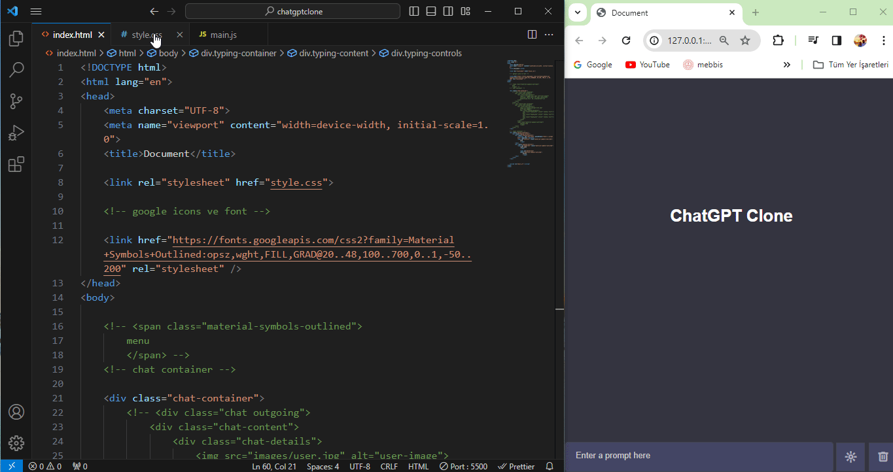

<h1>ChatGPT Clone</h1>

Bu proje, OpenAI'nin GPT-3 teknolojisini kullanarak etkileşimli bir sohbet arayüzü oluşturmayı amaçlar. 

<h2>Nasıl Çalışır?</h2>

Bu proje, HTML, CSS ve JavaScript kullanılarak geliştirildi. Geliştirilen arayüz, kullanıcıların metin girişi yapabileceği bir alan sunar. Kullanıcı metin girdikten sonra, bu giriş GPT-3 modeli üzerinden işlenir ve yanıt üretilir. Bu yanıt, sohbet arayüzünde gösterilir.

<h2>Özellikler</h2>

- Kullanıcı dostu arayüz
- Tema seçenekleri: Aydınlık/Dark Mod
- Sohbet geçmişi saklama
- Silme seçeneği

<h2>Ekran Görüntüleri</h2>

